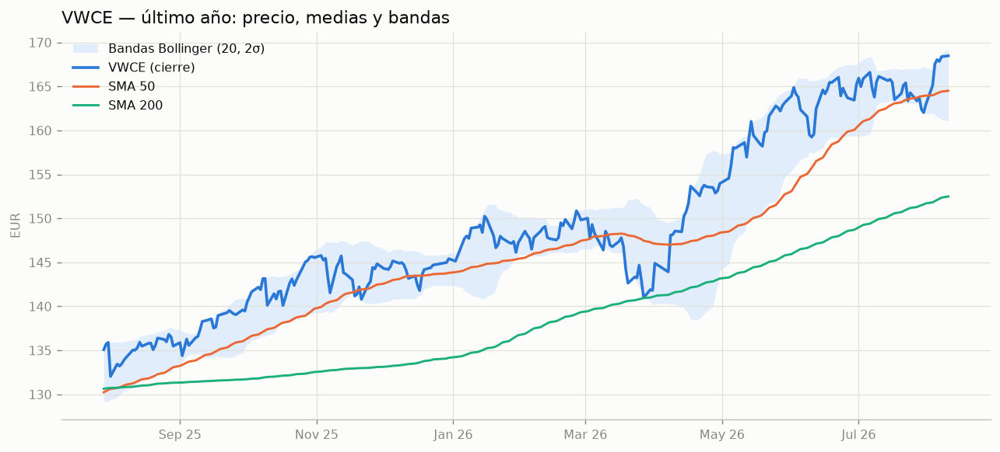
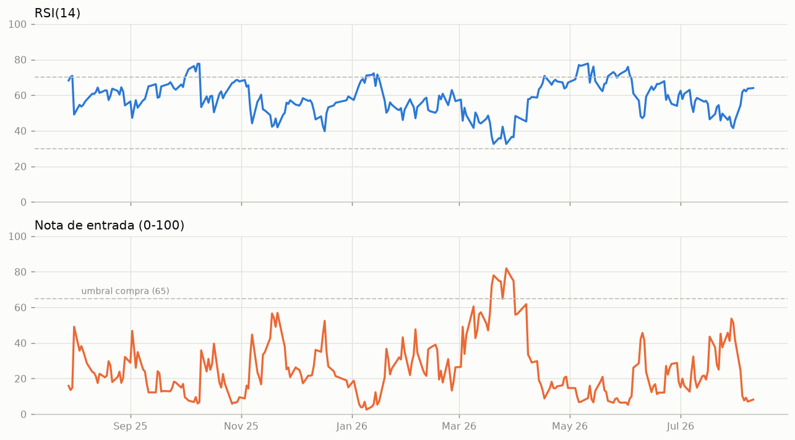
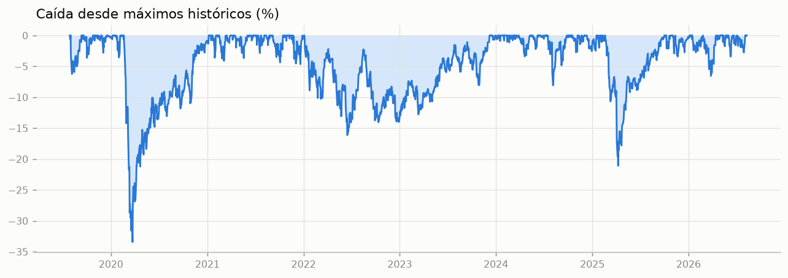
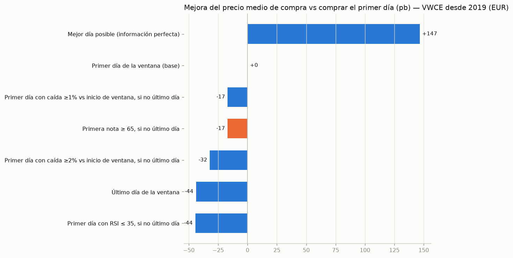
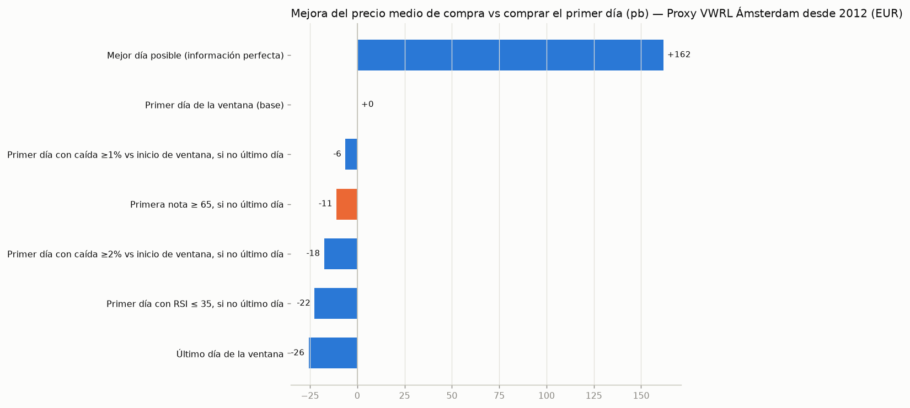
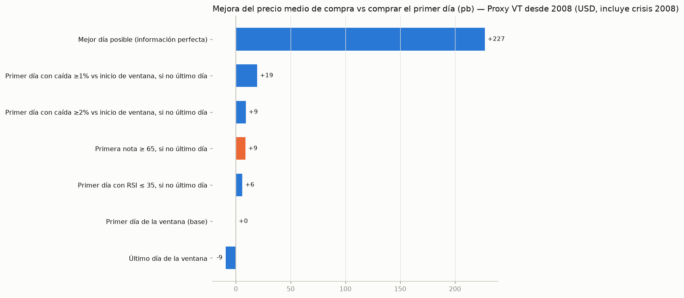
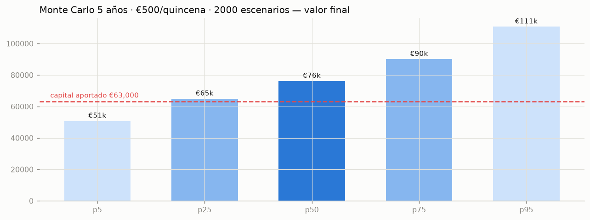

# Informe diario VWCE — 2026-08-11

**Vanguard FTSE All-World UCITS ETF (USD) Accumulating** · Xetra (IBIS2) · ISIN IE00BK5BQT80

## 1 · Resumen ejecutivo

| | |
|---|---|
| Cierre | **168.48 €** (+0.06% vs día anterior) |
| Nota de entrada | **8 / 100** |
| Régimen | alcista |
| Caída desde máximos | 0.0% |
| Datos a | 2026-08-10 (1 días) |

> **Decisión sugerida:** DÍA NORMAL/CARO según el modelo (nota 8 < 65). Ojo: el backtest muestra que *retrasar* la aportación esperando un día mejor no compensa en media — si hoy toca aportar según tu calendario, aporta. La nota sirve sobre todo para *adelantar* la entrada cuando aparece una señal fuerte (≥ 80), no para saltarse compras.

## 2 · Nota de entrada — desglose

Cada componente puntúa 0-100 (más alto = punto de entrada más favorable).

| Componente | Valor bruto | Nota | Peso |
|---|---|---|---|
| Caída desde máximos | 0.0% | 0 | 20% |
| RSI(14) | 64.0 | 15 | 20% |
| Distancia a SMA200 | +10.5% | 0 | 15% |
| Bollinger %B | 0.91 | 9 | 15% |
| Z-score 60 días | +1.97σ | 1 | 15% |
| Percentil VIX 5 años | 23% (VIX 15.3) | 25 | 15% |
| **Total** | | **8** | 100% |

## 3 · Cuadro técnico

| Indicador | Valor | Lectura |
|---|---|---|
| SMA 50 / SMA 200 | 164.51 / 152.49 | precio +2.4% vs SMA50, +10.5% vs SMA200 |
| RSI(14) | 64.0 | neutral |
| MACD (12,26,9) | hist +0.483 | momentum alcista |
| Bollinger %B | 0.91 | zona alta |
| Volatilidad 20d (anualizada) | 11.1% | ATR14 1.47 € |
| Máx / mín 52 semanas | 168.48 / 134.20 | precio al 100.0% del máximo |

## 4 · Contexto macro y fundamental

| Métrica | Valor | Comentario |
|---|---|---|
| VIX | 15.3 (percentil 5a: 23%) | calma |
| EURUSD | 1.1546 (-1.0% 3m, -0.9% 1a) | euro fuerte abarata VWCE en EUR |
| Tipos EEUU 10 años | 4.68% (+0.22 pp 3m) | tipos al alza presionan valoraciones |
| Tendencia largo plazo (CAGR desde 2019) | 11.8% anual | precio +10.6% vs tendencia (+1.4σ) |

**Descomposición de la rentabilidad a 1 año:** VWCE en EUR +25.8% ≈ índice mundial en USD +22.0% con EURUSD -0.9% (euro debilitándose (viento a favor)).

**Ficha del fondo:** índice FTSE All-World (~3.900 empresas, todo el mundo desarrollado y emergente) · TER 0.22% · acumulación · réplica física (muestreo optimizado) · domicilio Irlanda.

## 5 · Tu posición y próxima entrada

| | |
|---|---|
| Participaciones | 18.7056 |
| Precio medio | 165.03 € |
| Valor de mercado | 3,151.52 € |
| P&L latente | +64.53 € (+2.1%) |
| Si compras hoy 500 € | +2.9677 part. → precio medio 165.50 € |

## 6 · Backtest de estrategias de entrada quincenal

Cada estrategia invierte **500 € una vez por ventana de 14 días**; solo cambia el día elegido. "pb" = puntos básicos de mejora del precio medio de compra frente a comprar siempre el primer día. El *oráculo* (mejor día con información perfecta) marca el techo teórico de lo que se puede ganar eligiendo el día.

### VWCE desde 2019 (EUR)

| Estrategia                                                      |   Compras |   Precio medio |   Mejora (pb) |   Captura oráculo % |
|:----------------------------------------------------------------|----------:|---------------:|--------------:|--------------------:|
| Primer día de la ventana (base)                                 |       184 |        99.6271 |           0   |                 0   |
| Último día de la ventana                                        |       184 |       100.067  |         -43.9 |               -30.5 |
| Primera nota ≥ 65, si no último día                             |       184 |        99.7965 |         -17   |               -11.8 |
| Primer día con caída ≥1% vs inicio de ventana, si no último día |       184 |        99.7958 |         -16.9 |               -11.7 |
| Primer día con caída ≥2% vs inicio de ventana, si no último día |       184 |        99.9482 |         -32.1 |               -22.3 |
| Primer día con RSI ≤ 35, si no último día                       |       184 |       100.072  |         -44.5 |               -30.9 |
| Mejor día posible (información perfecta)                        |       184 |        98.1876 |         146.6 |               100   |
| Peor día posible                                                |       184 |       101.439  |        -178.7 |              -125.9 |

### Proxy VWRL Ámsterdam desde 2012 (EUR)

| Estrategia                                                      |   Compras |   Precio medio |   Mejora (pb) |   Captura oráculo % |
|:----------------------------------------------------------------|----------:|---------------:|--------------:|--------------------:|
| Primer día de la ventana (base)                                 |       371 |        75.846  |           0   |                 0   |
| Último día de la ventana                                        |       371 |        76.0415 |         -25.7 |               -16.2 |
| Primera nota ≥ 65, si no último día                             |       371 |        75.9294 |         -11   |                -6.9 |
| Primer día con caída ≥1% vs inicio de ventana, si no último día |       371 |        75.8929 |          -6.2 |                -3.9 |
| Primer día con caída ≥2% vs inicio de ventana, si no último día |       371 |        75.9794 |         -17.5 |               -11   |
| Primer día con RSI ≤ 35, si no último día                       |       371 |        76.0173 |         -22.5 |               -14.2 |
| Mejor día posible (información perfecta)                        |       371 |        74.6388 |         161.7 |               100   |
| Peor día posible                                                |       371 |        77.1464 |        -168.6 |              -107.7 |

### Proxy VT desde 2008 (USD, incluye crisis 2008)

| Estrategia                                                      |   Compras |   Precio medio |   Mejora (pb) |   Captura oráculo % |
|:----------------------------------------------------------------|----------:|---------------:|--------------:|--------------------:|
| Primer día de la ventana (base)                                 |       473 |        64.062  |           0   |                 0   |
| Último día de la ventana                                        |       473 |        64.1223 |          -9.4 |                -4.2 |
| Primera nota ≥ 65, si no último día                             |       473 |        64.0066 |           8.7 |                 3.9 |
| Primer día con caída ≥1% vs inicio de ventana, si no último día |       473 |        63.938  |          19.4 |                 8.7 |
| Primer día con caída ≥2% vs inicio de ventana, si no último día |       473 |        64.0036 |           9.1 |                 4.1 |
| Primer día con RSI ≤ 35, si no último día                       |       473 |        64.0243 |           5.9 |                 2.6 |
| Mejor día posible (información perfecta)                        |       473 |        62.6389 |         227.2 |               100   |
| Peor día posible                                                |       473 |        65.3206 |        -192.7 |               -88.4 |

**¿Y esperar la gran caída?** La variante que acumula el efectivo hasta ver nota ≥ 70 (máx. 3 ventanas) terminó con precio medio 100.11 € frente a 99.63 € comprando cada quincena (-48 pb). En este histórico, esperar NO compensó: en un activo con deriva alcista, el coste de estar fuera supera el descuento que se consigue.

## 7 · Simulación Monte Carlo (plan actual a 5 años)

Bootstrap por bloques de los rendimientos diarios históricos (2000 escenarios, aportando 500 € cada 14 días durante 5 años = 63,000 € aportados):

| Percentil | Valor final | TIR anualizada |
|---|---|---|
| p5 | 50,735 € | -8.5% |
| p25 | 64,882 € | +1.2% |
| p50 | 76,148 € | +7.6% |
| p75 | 90,029 € | +14.4% |
| p95 | 110,651 € | +22.9% |

Probabilidad de acabar por debajo del capital aportado: **21.1%**.

---

### Metodología y avisos

- Datos: Yahoo Finance (VWCE.DE; proxies VWRL.AS desde 2012 y VT desde 2008 para histórico largo; EURUSD, VIX, ^TNX).
- La nota de entrada es un modelo de reversión a la media: mide lo *barato que está hoy respecto a su propia historia reciente*, no predice el futuro.
- Rentabilidades pasadas no garantizan rentabilidades futuras. Esto es una herramienta de apoyo, **no asesoramiento financiero**.
- Generado automáticamente por el workflow diario de este repositorio.
